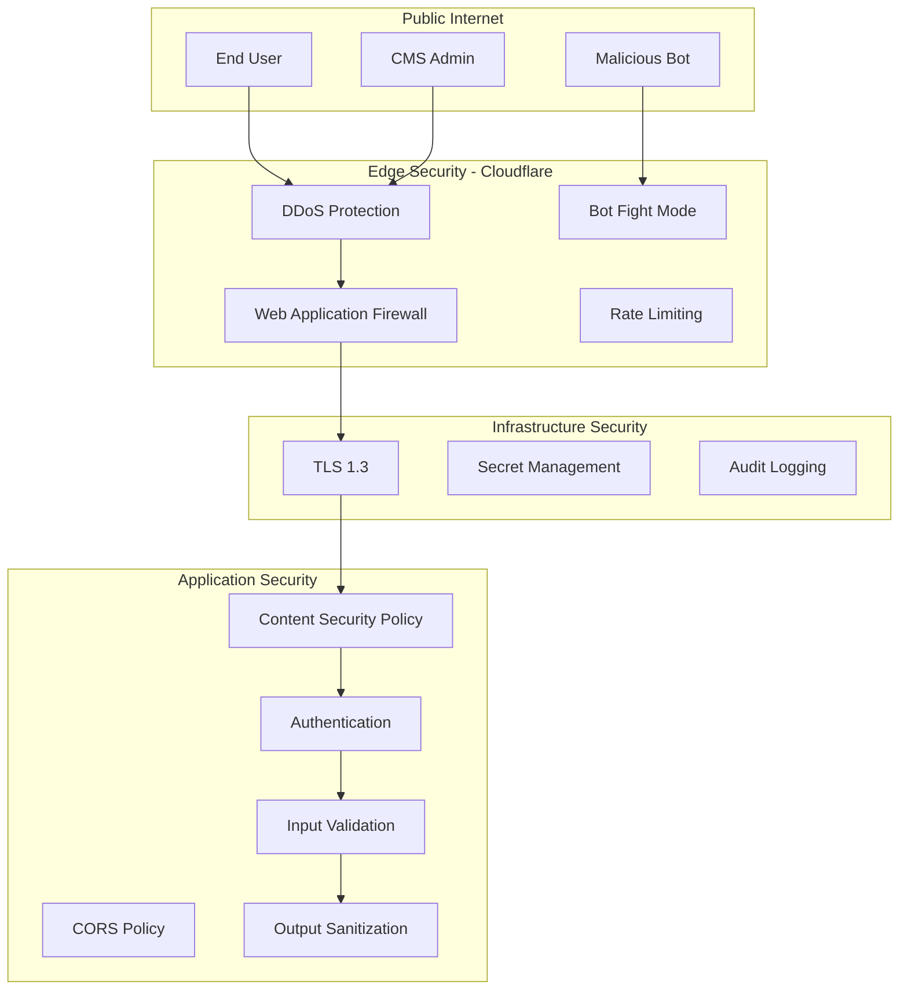

# Security Implementation

## Security Architecture



## Security Headers

```typescript
// middleware.ts
export function middleware(request: NextRequest) {
  const response = NextResponse.next();
  
  // Security headers
  response.headers.set('X-Content-Type-Options', 'nosniff');
  response.headers.set('X-Frame-Options', 'DENY');
  response.headers.set('X-XSS-Protection', '1; mode=block');
  response.headers.set('Referrer-Policy', 'strict-origin-when-cross-origin');
  response.headers.set(
    'Permissions-Policy',
    'camera=(), microphone=(), geolocation=()'
  );
  
  // CSP for luxury site (allowing specific CDNs)
  response.headers.set(
    'Content-Security-Policy',
    "default-src 'self'; " +
    "script-src 'self' 'unsafe-inline' 'unsafe-eval' https://www.googletagmanager.com; " +
    "style-src 'self' 'unsafe-inline' https://fonts.googleapis.com; " +
    "font-src 'self' https://fonts.gstatic.com; " +
    "img-src 'self' data: https://r2.princesspuff.rs https://www.google-analytics.com; " +
    "connect-src 'self' https://princess-puff-cms.up.railway.app https://www.google-analytics.com;"
  );
  
  return response;
}
```

## Authentication & Authorization

**CMS Access:**
- Strapi built-in authentication
- Role-based access control (Admin, Editor)
- 2FA enabled for admin accounts

**API Security:**
- Bearer token authentication
- Token rotation every 90 days
- IP whitelisting for production

## Data Protection

**PII Handling:**
- Contact form data encrypted in transit
- No PII stored in frontend
- GDPR-compliant data retention (90 days)

**Cookie Policy:**
```typescript
// lib/cookies.ts
export const cookieConfig = {
  necessary: {
    // No consent required
    session: { httpOnly: true, secure: true, sameSite: 'strict' }
  },
  analytics: {
    // Requires consent
    _ga: { expires: 365, secure: true, sameSite: 'lax' }
  }
};
```

## Vulnerability Management

**Dependency Scanning:**
```json
// package.json
{
  "scripts": {
    "audit": "npm audit --production",
    "audit:fix": "npm audit fix --force"
  }
}
```

**Security Checklist:**
- [ ] HTTPS enforced
- [ ] Security headers configured
- [ ] Input validation on all forms
- [ ] SQL injection prevention (via ORM)
- [ ] XSS prevention (React default escaping)
- [ ] CSRF tokens on state-changing operations
- [ ] Rate limiting on public endpoints
- [ ] Secrets in environment variables only
