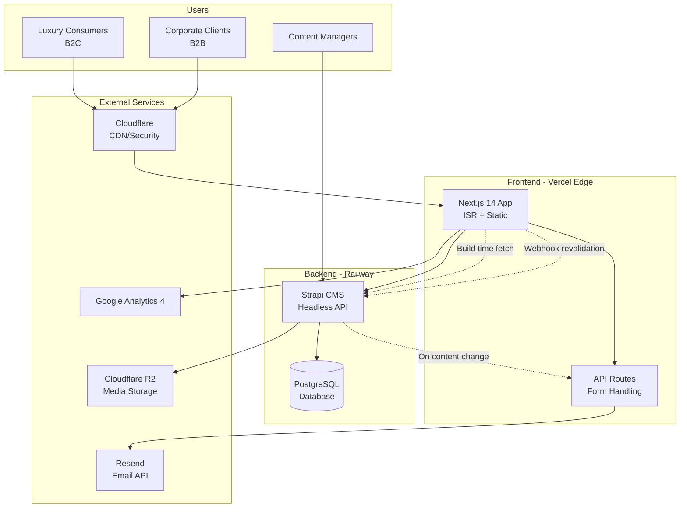

# High Level Architecture

## Technical Summary

The Princess Puff architecture employs a modern Jamstack approach with Next.js 14 (App Router) serving static and ISR pages from Vercel's edge network, while Strapi provides a flexible headless CMS deployed on Railway. Frontend and backend communicate via REST API with build-time data fetching for optimal performance, complemented by ISR for dynamic content updates. Infrastructure leverages Vercel's global CDN for the frontend, Railway for CMS hosting, Cloudflare R2 for cost-effective media storage, and Resend for transactional emails. This architecture achieves the PRD's luxury brand goals through blazing-fast page loads, SEO-optimized static generation, and a user-friendly CMS that enables non-technical staff to maintain the premium content experience.

## Platform and Infrastructure Choice

**Platform:** Vercel (Frontend) + Railway (CMS) + Cloudflare (CDN/Storage)
**Key Services:** Vercel hosting with Edge Network, Railway Starter for Strapi + PostgreSQL, Cloudflare R2 for S3-compatible storage, Resend for email delivery, Vercel Analytics for performance monitoring, Google Analytics 4 for business KPIs
**Deployment Host and Regions:** Vercel Global Edge Network (automatic), Railway US-West (Oregon), Cloudflare global with EU storage compliance

## Repository Structure

**Structure:** Separate repositories for better deployment isolation
**Monorepo Tool:** N/A - Using separate repos for frontend and CMS
**Package Organization:** princess-puff-web (Next.js frontend), princess-puff-cms (Strapi backend), shared types via TypeScript declaration files

## High Level Architecture Diagram



## Edge/CDN Configuration

**Cloudflare Setup Strategy:**
- **App domain (princesspuff.rs):** DNS-only mode - let Vercel handle all caching and ISR
- **Media domain (media.princesspuff.rs):** Full proxy mode with aggressive caching
- **Critical:** This prevents ISR breakage and ensures content updates work correctly

**Page Rules Configuration:**
```
1. princesspuff.rs/*
   - Cache Level: Bypass
   - Reason: Let Vercel handle HTML/ISR caching
   
2. media.princesspuff.rs/*
   - Cache Level: Cache Everything
   - Edge Cache TTL: 1 month
   - Browser Cache TTL: 1 week
```

## Architectural Patterns

- **Jamstack Architecture:** Static site generation with Next.js for optimal performance and SEO
  - _Rationale:_ Luxury brand requires instant page loads and perfect SEO to match premium positioning
- **Headless CMS Pattern:** Strapi provides content API consumed by Next.js at build time
  - _Rationale:_ Enables non-technical staff to manage content while maintaining performance through static generation
- **Component-Based UI:** Modular React components with TypeScript for the Luxe Noir design system
  - _Rationale:_ Ensures consistent luxury aesthetic across all pages while enabling rapid development
- **ISR with Webhook Revalidation:** On-demand revalidation via Strapi webhooks with tag-based cache invalidation
  - _Rationale:_ Ensures content managers see changes immediately while maintaining static performance benefits
- **API Routes Pattern:** Next.js API routes handle form submissions and third-party integrations
  - _Rationale:_ Keeps sensitive operations server-side while maintaining simple architecture
- **Edge Caching Pattern:** Cloudflare CDN with aggressive caching for static assets
  - _Rationale:_ Global performance for international luxury consumers with minimal latency

**Key Assumptions:**
- Railway's cold starts (acknowledged in PRD) won't significantly impact content manager experience
- Separate repositories provide sufficient code sharing through TypeScript definitions
- 5-minute ISR revalidation meets business needs for content freshness
- Cloudflare R2's egress-free model significantly reduces media serving costs

**Trade-offs Made:**
- Chose separate repos over monorepo for simpler deployment and security isolation
- Selected REST API over GraphQL for simpler implementation given tight timeline
- Picked Railway Starter despite cold starts due to cost-effectiveness for MVP
- Opted for ISR over full SSR to maximize performance for luxury experience
