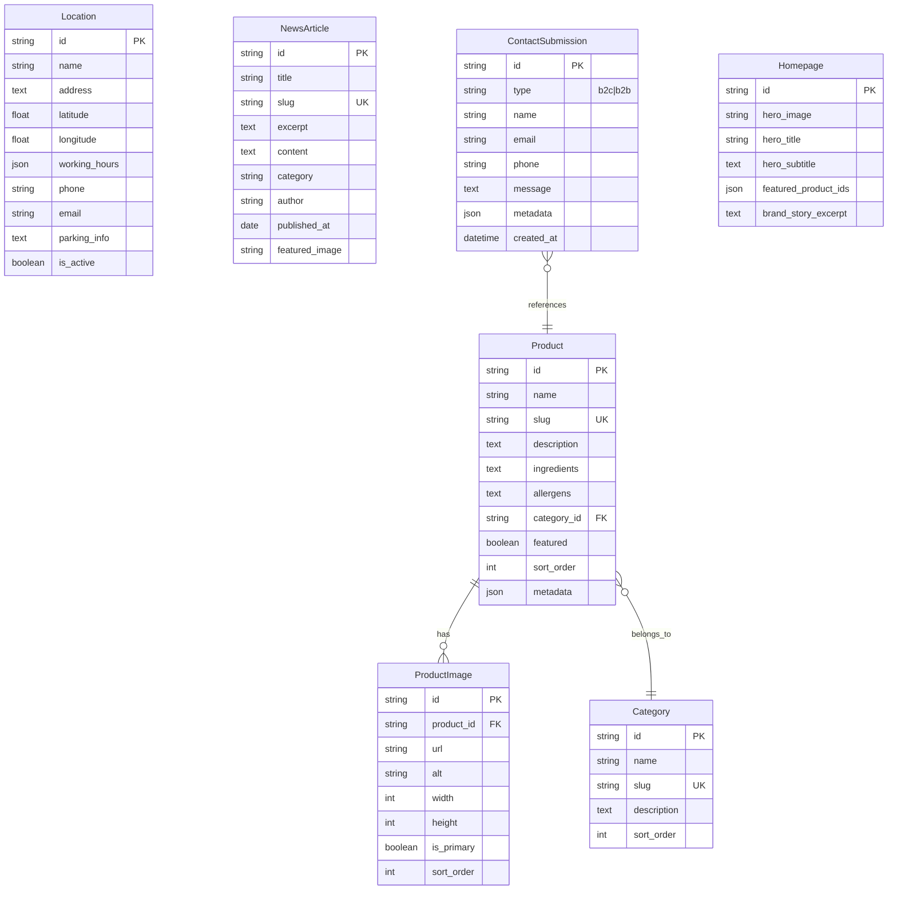

# Schema and Data Models

## Entity Relationship Diagram



## Database Choice

**Primary Database:** PostgreSQL 15+ on Railway
**Rationale:** 
- Native Strapi support with excellent performance
- JSONB support for flexible metadata storage
- Full-text search capabilities for future enhancements
- Railway's managed PostgreSQL removes operational overhead
- Automatic backups included

**Media Storage:** Cloudflare R2 (S3-compatible)
**Rationale:**
- Zero egress fees (critical for image-heavy luxury site)
- Global CDN distribution included
- S3 compatibility works with Strapi upload plugin
- Cost-effective for storing high-res product photography

## Data Modeling Principles

1. **Flexible Metadata:** Using JSONB fields for extensibility without migrations
2. **SEO-First:** Slug fields on all public entities with uniqueness constraints
3. **Audit Trail:** created_at, updated_at on all entities via Strapi
4. **Soft Deletes:** For products and content (Strapi draft/publish system)
5. **Normalized Where Needed:** Separate tables for images to support galleries
6. **Denormalized for Performance:** Homepage content as single entity

## Critical Data Relationships

- **Product → Category:** Many-to-one for simple categorization
- **Product → Images:** One-to-many for future gallery support
- **Contact → Product:** Optional reference for product inquiries
- **Homepage → Products:** Array of IDs for featured products

## Data Migration Strategy

**Initial Seed Data:**
```javascript
// seed-data.js
const categories = [
  { name: 'Signature Collection', slug: 'signature' },
  { name: 'Seasonal Specials', slug: 'seasonal' },
  { name: 'Corporate Gifts', slug: 'corporate' }
];

const products = [
  {
    name: 'Royal Princess',
    slug: 'royal-princess',
    description: 'Our flagship donut with 24k gold leaf',
    category: 'signature',
    featured: true
  }
  // ... 5 more products
];
```
