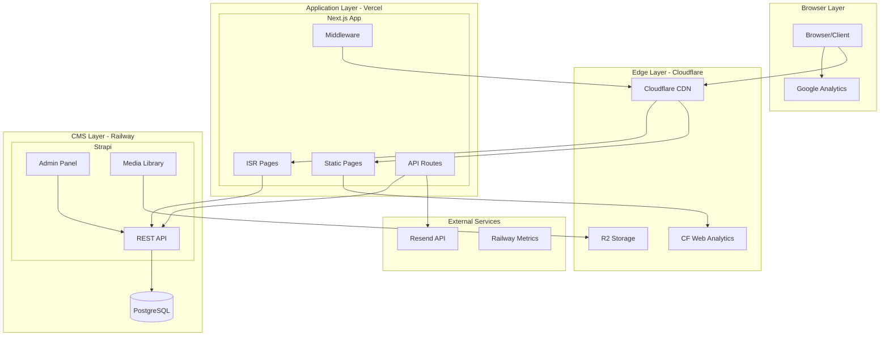
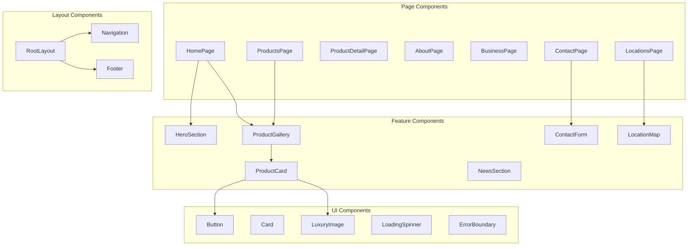
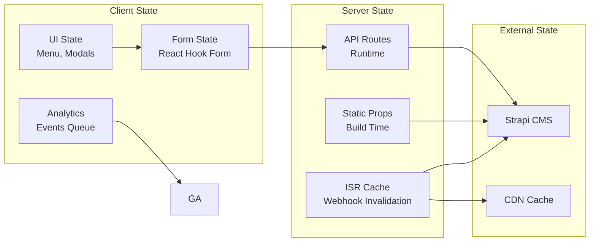
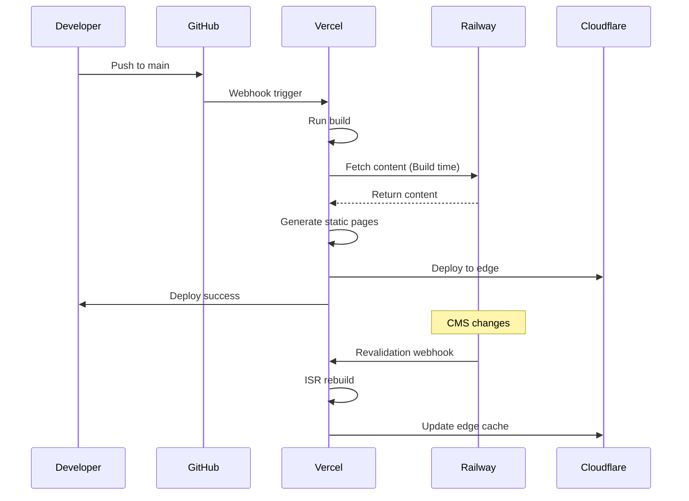

# System Design and Key Components

## System Architecture Diagram

```mermaid
graph TB
    subgraph "Browser Layer"
        B[Browser/Client]
        GA[Google Analytics]
    end

    subgraph "Edge Layer - Cloudflare"
        CF[Cloudflare CDN]
        CFW[CF Web Analytics]
        R2[R2 Storage]
    end

    subgraph "Application Layer - Vercel"
        subgraph "Next.js App"
            Pages[Static Pages]
            ISR[ISR Pages]
            API[API Routes]
            MW[Middleware]
        end
    end

    subgraph "CMS Layer - Railway"
        subgraph "Strapi"
            REST[REST API]
            Admin[Admin Panel]
            Upload[Media Library]
        end
        PG[(PostgreSQL)]
    end

    subgraph "External Services"
        Email[Resend API]
        NeonKVM[Railway Metrics]
    end

    B --> CF
    CF --> Pages
    CF --> ISR
    B --> GA
    Pages --> CFW
    
    ISR --> REST
    API --> Email
    API --> REST
    
    Admin --> REST
    REST --> PG
    Upload --> R2
    
    MW --> CF
```

## Frontend Page Components Architecture

```mermaid
graph TD
    subgraph "Page Components"
        HP[HomePage]
        PP[ProductsPage]
        PDP[ProductDetailPage]
        AP[AboutPage]
        BP[BusinessPage]
        CP[ContactPage]
        LP[LocationsPage]
    end

    subgraph "Layout Components"
        RL[RootLayout]
        NAV[Navigation]
        FOOT[Footer]
    end

    subgraph "Feature Components"
        HC[HeroSection]
        PG[ProductGallery]
        PC[ProductCard]
        CF[ContactForm]
        MAP[LocationMap]
        NS[NewsSection]
    end

    subgraph "UI Components"
        BTN[Button]
        CARD[Card]
        IMG[LuxuryImage]
        LOAD[LoadingSpinner]
        ERR[ErrorBoundary]
    end

    RL --> NAV
    RL --> FOOT
    HP --> HC
    HP --> PG
    PP --> PG
    PG --> PC
    PC --> IMG
    PC --> BTN
    CP --> CF
    LP --> MAP
```

## State Management Flow

```mermaid
graph LR
    subgraph "Client State"
        UI[UI State<br/>Menu, Modals]
        Form[Form State<br/>React Hook Form]
        Analytics[Analytics<br/>Events Queue]
    end

    subgraph "Server State"
        ISR[ISR Cache<br/>Webhook Invalidation]
        Static[Static Props<br/>Build Time]
        Dynamic[API Routes<br/>Runtime]
    end

    subgraph "External State"
        CMS[Strapi CMS]
        CDN[CDN Cache]
    end

    UI --> Form
    Form --> Dynamic
    Dynamic --> CMS
    Static --> CMS
    ISR --> CMS
    ISR --> CDN
    Analytics --> GA
```

## Build and Deployment Flow

```mermaid
sequenceDiagram
    participant Dev as Developer
    participant GH as GitHub
    participant V as Vercel
    participant R as Railway
    participant CF as Cloudflare

    Dev->>GH: Push to main
    GH->>V: Webhook trigger
    V->>V: Run build
    V->>R: Fetch content (Build time)
    R-->>V: Return content
    V->>V: Generate static pages
    V->>CF: Deploy to edge
    V->>Dev: Deploy success

    Note over R: CMS changes
    R->>V: Revalidation webhook
    V->>V: ISR rebuild
    V->>CF: Update edge cache
```
