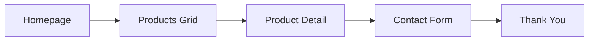
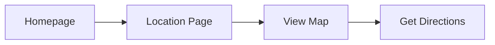

# Princess Puff MVP Front-End Specification

> **Version**: MVP 1.0  
> **Scope**: Minimum Viable Product for rapid market entry  
> **Timeline**: 4-6 weeks to launch  
> **Focus**: Core functionality with luxury aesthetic

## Executive Summary

This MVP specification focuses on essential features needed to launch Princess Puff's luxury pastry website. Advanced features have been documented separately in `post-mvp-features.md` for future implementation.

## MVP Scope

### What's Included ✅
- Single theme (Luxe Noir - black/gold)
- Product gallery with basic details
- Contact form for inquiries
- Store location with map
- Mobile-responsive design
- Essential accessibility (WCAG AA)
- Basic SEO and analytics
- Serbian language only

### What's Deferred 📋
- Day/Night theme switching → Phase 2
- Editorial content system → Phase 3
- B2B visual builder → Phase 3
- Multi-language support → Phase 2
- Advanced animations → Phase 3
- PWA features → Phase 3

## Target Users (MVP Focus)

**Primary**: Luxury Dessert Enthusiasts in Belgrade
- Affluent locals seeking premium pastries
- Special occasion shoppers
- Instagram-conscious customers
- Mobile-first browsing (70%+)

**Secondary**: Walk-in Discovery
- Tourists finding the boutique
- Local foot traffic
- Word-of-mouth referrals

## Core User Flows

### Flow 1: Browse → Contact


### Flow 2: Find Store Location


## Information Architecture (Simplified)

```
/                    Homepage
├── /proizvodi       Products
│   └── /{id}       Product Detail
├── /lokacija       Location & Hours
├── /kontakt        Contact Form
└── /o-nama         About (optional for MVP)
```

## Visual Design

### Single Theme: Luxe Noir

**Color Palette**
```css
:root {
  --color-black: #000000;
  --color-gold: #D4A574;
  --color-white: #FFFFFF;
  --color-gray: #CCCCCC;
  --color-error: #EF4444;
  --color-success: #10B981;
}
```

**Typography**
- Headlines: Playfair Display (serif)
- Body: Inter (sans-serif)  
- Base size: 16px
- Scale: 14px, 16px, 24px, 32px, 48px

**Layout Principles**
- 8px grid system
- Maximum content width: 1200px
- Mobile margins: 16px
- Desktop margins: 48px
- Card spacing: 24px

## Core Components

### 1. Button
```typescript
interface ButtonProps {
  children: React.ReactNode;
  variant: 'primary' | 'secondary';
  onClick?: () => void;
  disabled?: boolean;
  type?: 'button' | 'submit';
}
```

**Styles**
- Primary: Gold background, black text
- Secondary: Gold border, transparent background
- Hover: Opacity 0.9
- Active: Scale 0.98
- Disabled: Opacity 0.5

### 2. ProductCard
```typescript
interface ProductCardProps {
  product: {
    id: string;
    name: string;
    image: string;
    price: number;
  };
  onClick: (id: string) => void;
}
```

**Features**
- Lazy-loaded image
- Product name overlay
- Price display
- Hover: Opacity 0.9
- Mobile: Full width
- Desktop: Grid layout

### 3. FormField
```typescript
interface FormFieldProps {
  label: string;
  name: string;
  type: 'text' | 'email' | 'tel' | 'textarea';
  required?: boolean;
  error?: string;
}
```

**Styling**
- Gold underline on focus
- Error state with red text
- Floating label animation
- Clear error messages

### 4. Header
```html
<header>
  <Logo />
  <Nav items={['Proizvodi', 'Lokacija', 'Kontakt']} />
  <CTAButton />
</header>
```

**Behavior**
- Fixed on desktop
- Static on mobile
- Transparent → Black on scroll
- Mobile: Hamburger menu

## Page Specifications

### Homepage
**Above Fold**
- Hero image (single signature donut)
- Brand tagline
- Two CTAs: "Proizvodi" and "Kontakt"

**Below Fold**
- 4-6 featured products
- Location teaser with map
- Contact CTA

### Products Page
**Layout**
- Grid of product cards
- 1 column mobile, 3 columns desktop
- No filtering (curated selection)
- 12-16 products maximum

**Product Detail Modal**
- Large product image
- Name and description
- Price
- Ingredients list (expandable)
- Contact CTA
- Close button

### Location Page
**Content**
- Store photo
- Address with Google Maps embed
- Opening hours
- Phone number (clickable)
- Directions button

### Contact Page
**Form Fields**
- Name (required)
- Email (required)
- Phone (required)
- Message (optional)
- Honeypot (hidden spam field)

**Validation**
- Client-side validation
- Serbian error messages
- Success message after submission

## Technical Implementation

### Tech Stack
- Next.js 14 (App Router)
- TypeScript
- Tailwind CSS
- React Hook Form
- Google Maps Embed API

### Performance Targets
- LCP: < 2.5s
- FCP: < 1.5s
- TTI: < 3.5s
- Bundle size: < 200KB JS

### Image Optimization
```javascript
// next.config.js
module.exports = {
  images: {
    domains: ['princesspuff.rs'],
    formats: ['image/webp'],
    deviceSizes: [375, 768, 1200]
  }
}
```

### SEO Essentials
```html
<head>
  <title>{title} | Princess Puff</title>
  <meta name="description" content="{description}" />
  <meta property="og:image" content="{image}" />
  <link rel="canonical" href="{url}" />
</head>
```

### Basic Analytics
```javascript
// Track only essential events
gtag('event', 'page_view');
gtag('event', 'form_submit', {
  form_name: 'contact'
});
gtag('event', 'click', {
  button_name: 'get_directions'
});
```

## Accessibility (MVP Requirements)

### Visual
- Color contrast 4.5:1 minimum
- Focus indicators (2px gold outline)
- Text readable at 200% zoom

### Interaction  
- Keyboard navigation
- Form labels always visible
- Error messages announced
- Alt text for product images

### Mobile
- Touch targets 44x44px minimum
- Thumb-friendly navigation
- No hover-dependent features

## Responsive Breakpoints

```scss
// Mobile First
.container {
  padding: 16px;
  
  @media (min-width: 768px) {
    padding: 24px;
    max-width: 720px;
  }
  
  @media (min-width: 1024px) {
    padding: 48px;
    max-width: 1200px;
  }
}
```

## Development Checklist

### Pre-Launch Must-Haves
- [ ] Products loaded (12-16 items)
- [ ] Contact form working
- [ ] Google Maps configured
- [ ] Mobile testing complete
- [ ] Page load < 3 seconds
- [ ] Meta tags configured
- [ ] Analytics installed
- [ ] Legal pages (Terms, Privacy)
- [ ] Cookie consent banner
- [ ] 404 page designed

### Launch Day
- [ ] DNS configured
- [ ] SSL certificate active
- [ ] Forms tested
- [ ] Analytics verified
- [ ] Monitoring active

## Post-MVP Roadmap

### Month 1: Monitor & Optimize
- User behavior analysis
- Performance optimization
- Bug fixes
- Content updates

### Month 2-3: Phase 2 Features
- English language
- Product filtering  
- B2B contact form
- Enhanced analytics

### Month 4-6: Phase 3 Features
- Theme switching
- Editorial content
- Visual builder
- Advanced features

See `post-mvp-features.md` for detailed specifications of deferred features.

## Success Metrics

### Week 1
- 500+ unique visitors
- 50+ form submissions  
- < 3s page load time
- 0 critical bugs

### Month 1
- 2,000+ unique visitors
- 200+ inquiries
- 20% returning visitors
- 4.5+ star reviews

## Conclusion

This MVP specification delivers a luxury experience with minimal complexity. By focusing on core features and deferring advanced functionality, we can launch quickly while maintaining the premium Princess Puff brand standards.

**Next Steps**:
1. Review and approve specification
2. Begin development sprint
3. Weekly progress reviews
4. Launch in 4-6 weeks

---

*For advanced features and future enhancements, refer to `post-mvp-features.md`*